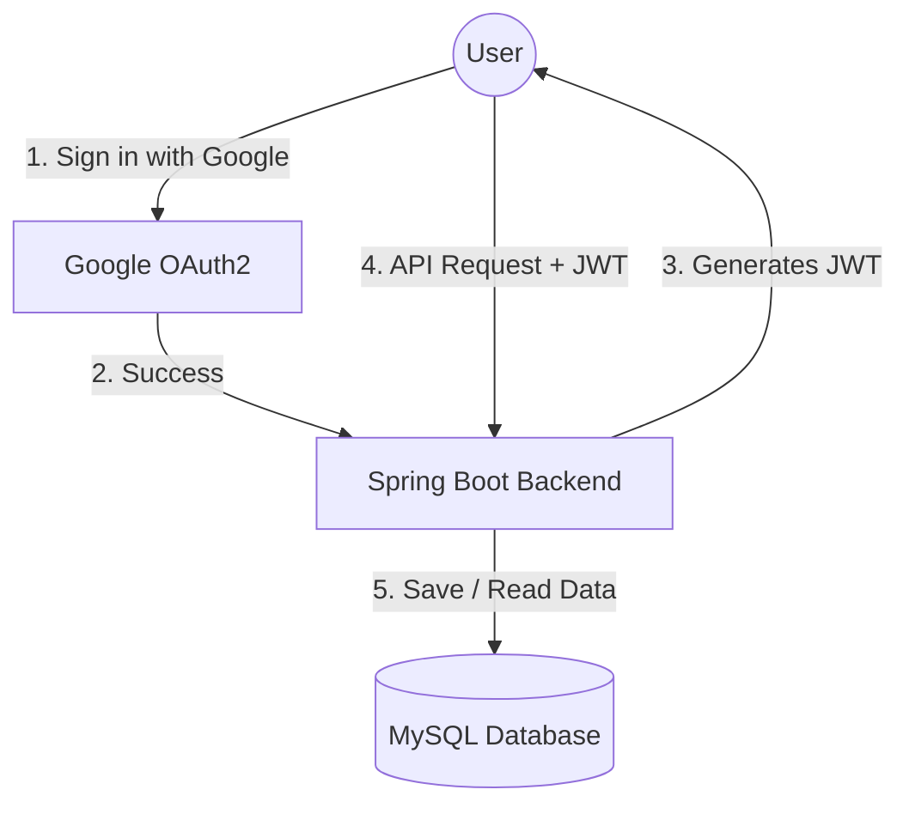

# Employee Management System

A simple REST API built with **Spring Boot** to manage employees, featuring secure authentication using **Google OAuth2** and **JWT**.

##  Tech Stack
- **Backend:** Java 17, Spring Boot 3
- **Database:** MySQL, Spring Data JPA
- **Security:** Spring Security, Google OAuth2, JWT (JSON Web Tokens)

---

##  Architecture

Here is a simple flow of how the authentication and API requests work:



---

##  How to Run Locally

### 1. Database Setup
Create an empty database named `EMP` in your local MySQL server:
```sql
CREATE DATABASE EMP;
```

### 2. Configure Credentials 
Create a `.env` file in the root folder of the project and add your Google Client ID and Secret:
```env
GOOGLE_CLIENT_ID=your_client_id_here
GOOGLE_CLIENT_SECRET=your_client_secret_here
```

### 3. Build & Start the Server
Run the following commands in your terminal:
```bash
mvn clean install
mvn spring-boot:run
```
The server will start on `http://localhost:8081`. 

*(Note: The database tables will be created automatically when you start the app).*

### 4. Test Login
Open your browser and navigate to:
```
http://localhost:8081/oauth2/authorization/google
```
Log in with your Google account, and you will see your generated JWT token displayed perfectly on the screen!
